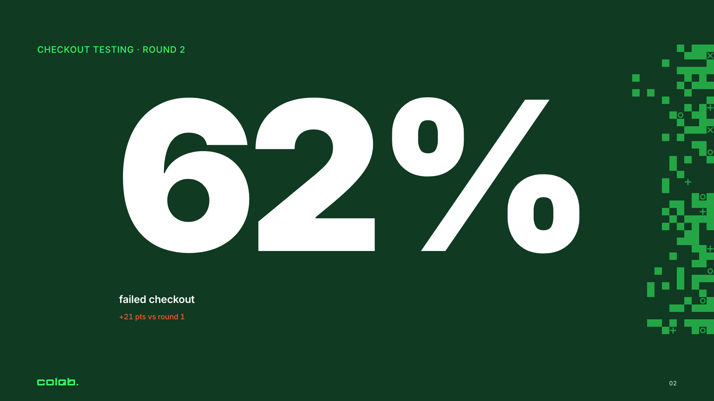
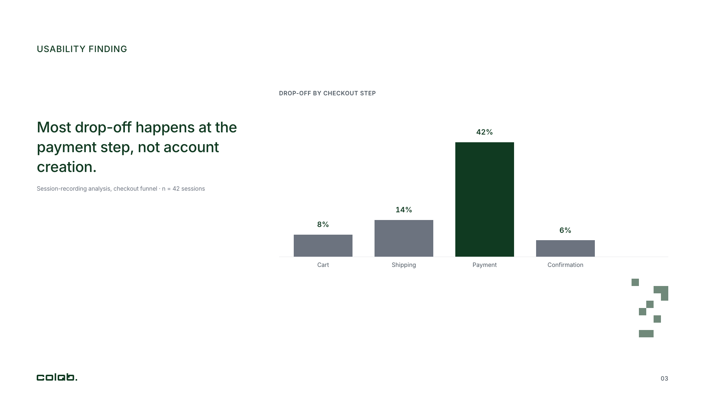
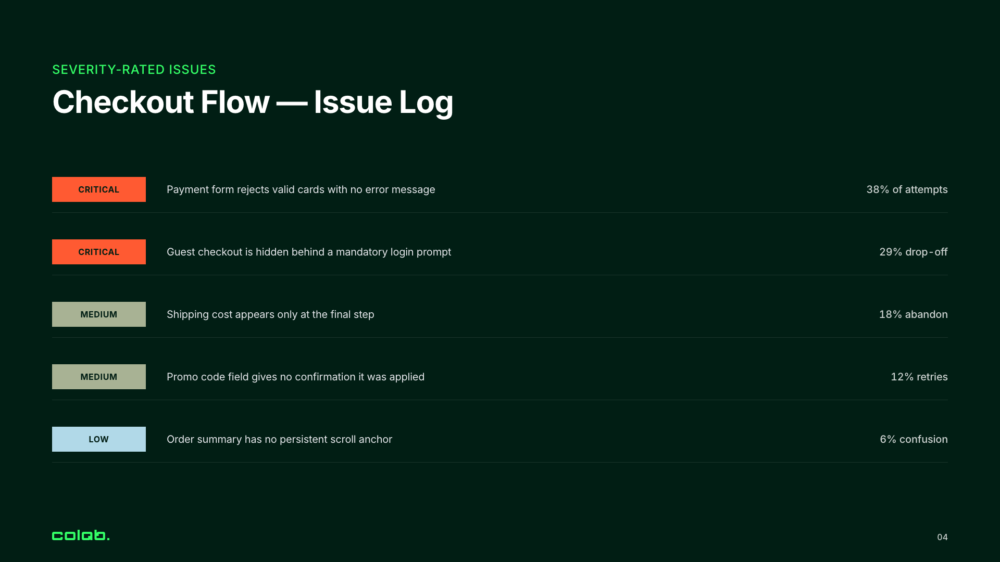
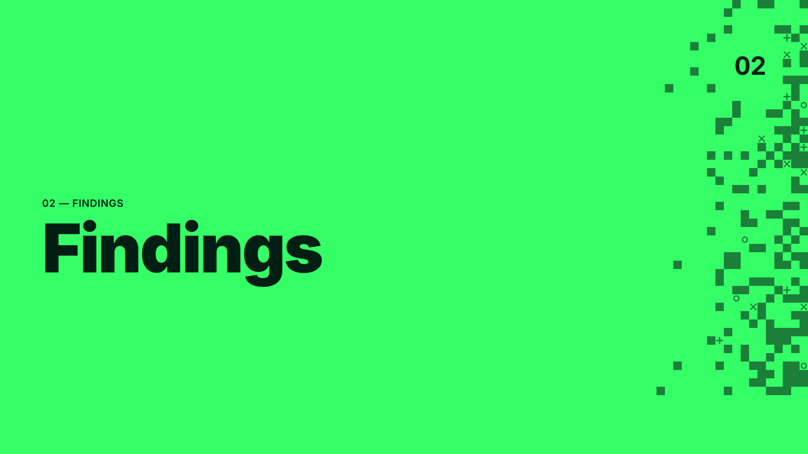
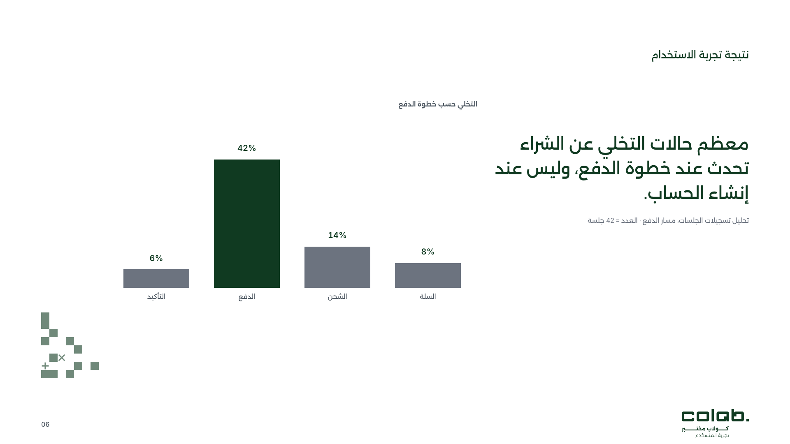
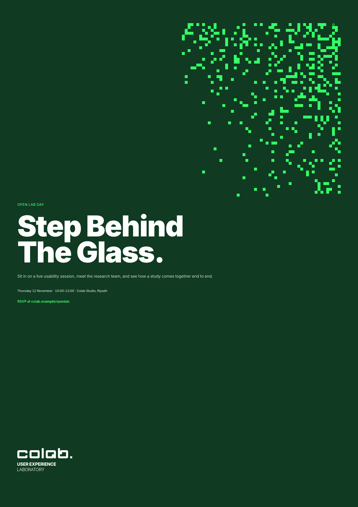
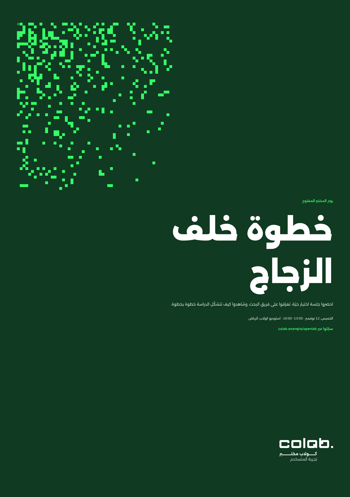
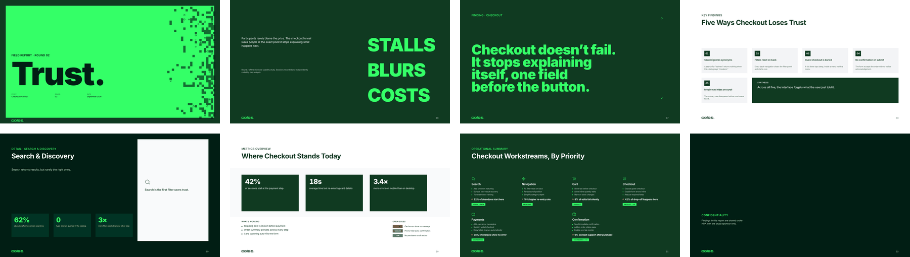

# What you get: output examples

Eight requests a designer or an agent sends every week, and what comes back once the skill is installed. The answers are shortened, and the wording varies from run to run. The numbers do not vary, because every one comes from the skill's references: contrast is computed with the WCAG 2.x formula, and geometry comes from the measured Figma grid.

Without the skill, an agent answers these from general design taste. With it, the agent answers from Colab's own rules and shows the measurement behind each one.

| # | You ask for | You get |
|---|---|---|
| 1 | [A colour check](#1-a-colour-check) | A yes or no, the measured ratio, and the legal alternative |
| 2 | [A findings slide](#2-a-findings-slide) | Archetype, ground, exact coordinates, and what not to do |
| 3 | [A severity scale](#3-a-severity-scale) | The fixed ordinal mapping, with contrast per ground |
| 4 | [Web tokens](#4-web-tokens) | Paste-ready CSS built from the published values |
| 5 | [An Arabic version](#5-an-arabic-version) | The mirror transform, re-fitted rhythm, and bidi traps |
| 6 | [An icon](#6-an-icon) | The exact Hugeicons name, size, stroke, colour, and file |
| 7 | [A slide review](#7-a-slide-review) | Numbered violations with the rule each one breaks |
| 8 | [A dither A4 poster](#8-a-dither-a4-poster) | The A4 grid, the fixed template, the field/type-zone split, and the EN/AR mirror |

## Example slides

Six slides built to the skill's rules: the grid, vertical anchors, the four grounds, the type scale and the computed motif. The copy is placeholder research copy.

| | |
|---|---|
|  |  |
| **1. Cover.** Archetype 1, Deep Jade ground, motif bleeding off the right edge | **2. Big number.** Archetype 5 on Jade, one comparison, motif in the margin only |
|  |  |
| **3. Claim + evidence.** Archetype 3 on white; accents are Pine, never Electric | **4. Severity list.** Archetype 10, the fixed severity scale, no motif |
|  |  |
| **5. Divider.** Archetype 2, Electric flood, Deep Jade text, motif clear of every text box | **6. Arabic mirror.** Slide 3 through `x' = 1920 − x − w`, Arabic lockup, motif re-solved |

## Example posters

The A4 dither poster, built on the poster grid in [`references/pixel-dither-posters.md`](references/pixel-dither-posters.md) (2480 × 3508 px at 300 dpi, 6 columns × 340 px, field zone in a top corner, type zone below). English and its Arabic mirror; the Arabic field is solved again, not flipped. Full-resolution files sit beside the previews in `assets/examples/posters/`.

| | |
|---|---|
|  |  |
| **P1. English poster.** §9.1: Pine ground, field top-right, one accent marker | **P2. Arabic mirror.** §9.2: field re-solved top-left, Arabic lockup, numerals left-to-right |

## The newer archetypes

One slide for each of archetypes 15 to 22, built to the current rules (no Electric on light grounds, no content-slide motif while Q-9 is open). Sources in `assets/examples/archetypes/src/`.



## Answers the skill gives

The assets it works with are real files in this repository:

<p>
  
  &nbsp;&nbsp;
  
  &nbsp;&nbsp;
  
  
  
  
</p>

---

## 1. A colour check

> **Prompt:** Can I put the Electric Green eyebrow on the white slide?

> **Output:**
> No. `#34FF67` on white measures **1.34 : 1**. That fails every threshold, including the 3 : 1 floor for non-text marks. Jade Green is worse at **1.29 : 1**, so it is not a substitute.
>
> On a light ground the accent role goes to **Pine Green `#103A21`** at **12.73 : 1**, or **Olive Green `#5B6B3E`** at **5.81 : 1** as the second tier.
>
> If the eyebrow has to be green, change the ground instead. Set the slide's `02 Semantic` mode to `Jade` or `Dark`, where Electric Green measures 9.49 : 1 on Pine and 13.07 : 1 on Deep Jade.

## 2. A findings slide

> **Prompt:** Build a slide for "62% of participants failed to finish checkout", previous round 41%.

> **Output:**
> **Archetype 5, single big-number hero.** One metric is the message, so the number is the headline.
>
> | Element | Spec |
> |---|---|
> | Ground | `Jade` mode, rotated against the slides either side |
> | Eyebrow | `Caps/M` 24, Electric Green, top at **y 120**, left edge x 100 |
> | Numeral | `62%`, C2 to C6 (x 320 to 1160), cap-height **380 to 420 px**, white, tabular figures |
> | Comparison | Exactly one: `+21 pts vs round 1`, in Vivid Orange because more failures is a regression |
> | Label | Three words or fewer, `failed checkout`, on the **same left edge** as the numeral, not centred under it |
> | Motif | C7 to C8 margin strip only, never behind the numeral |
> | Footer | Band from y 982 to 1080, untouched |
>
> Not included: a second stat, a bullet list, or a centred layout. A number with several comparisons reads as decoration.

## 3. A severity scale

> **Prompt:** Give me severity colours for the usability issues table.

> **Output:**
> The mapping is fixed so a reader can skim findings by colour. The palette has no red on purpose.
>
> | Severity | On a light ground | On Pine Green |
> |---|---|---|
> | Critical / High | Vivid Orange `#FF5A32`, 3.11 : 1, marks and large text only | `#FF5A32`, 4.10 : 1 |
> | Medium | Olive Green `#5B6B3E`, 5.81 : 1 | Olive `/onDark` `#A8B294`, 5.74 : 1 |
> | Low | Pale Sky `/onLight` `#3C7E94`, 4.56 : 1 | Pale Sky Blue `#B1D9E8`, 8.46 : 1 |
>
> The base Olive fails on Pine at 2.19 : 1 and the base Pale Sky fails on white at 1.50 : 1, so each ground takes its own tone of the same hue.
>
> Vivid Orange is never body text on any ground. Use archetype 10, the severity-rated issue list: severity chip in C1 (fixed 180 px), description C2 to C6, metric or screen reference C7 to C8, five or six rows at most, and no motif on the slide.

## 4. Web tokens

> **Prompt:** I'm building the Colab landing page in HTML. Give me the design tokens.

> **Output:**
> ```css
> :root {
>   /* primary */
>   --colab-electric: #34FF67;   /* accent on dark only: 1.34:1 on white */
>   --colab-pine:     #103A21;   /* default dark surface, logo default */
>   --colab-jade:     #33FFC2;   /* secondary accent, sparingly */
>   --colab-grey:     #BCBEC0;   /* true neutral, dark grounds only */
>   /* secondary: categorical, not decoration */
>   --colab-orange:     #FF5A32; /* critical severity */
>   --colab-deep-jade:  #011E14; /* deepest ground, white 17.54:1 */
>   --colab-olive:      #5B6B3E; /* medium severity, accent on light */
>   --colab-sky:        #B1D9E8; /* low severity */
>
>   --font-en: "Inter", sans-serif;
>   --font-ar: "Alexandria", sans-serif;
>   --leading-display: 0.90;     /* 0.95 below 100px */
>   --leading-body: 1.35;
>   --leading-ar: 1.5;           /* every size, tracking 0 */
>   --tracking-caps: 0.04em;     /* 0.06em at 12px */
>   --motif-module: 20px;
> }
> ```
> Buttons with an Electric Green fill take **Deep Jade** text (13.07 : 1), never white.

## 5. An Arabic version

> **Prompt:** Mirror slide 12 for the Arabic deck. The claim block sits at x 100, width 820.

> **Output:**
> RTL is a coordinate transform, not right alignment.
>
> - **Mirror:** `x' = 1920 − x − w` = 1920 − 100 − 820 = **x 1000**. Columns swap C1↔C8, C2↔C7, C3↔C6, C4↔C5.
> - **Re-fit the vertical rhythm.** Arabic leading is ×1.5 against English display at ×0.90, so a stat block grows about **1.67×** taller. Re-space the block. Do not shrink the type.
> - **Type:** Alexandria, same sizes as English, tracking 0, set through the `AR` mode of `04 Typography`.
> - **Numerals** stay left-to-right in Inter. Write ranges as `25-34` with an ASCII hyphen, because an en dash flips it to `34–25`.
> - **Auto-layout:** reverse child order in horizontal stacks at every level. Vertical stacks take `counterAxisAlignItems: MAX`.
> - **Logo:** use the Arabic lockup. Never mirror the logo.
> - **Motif:** solve it again last, after translation. A mirrored field lands on text.

## 6. An icon

> **Prompt:** I need a "task completed" icon for a white results slide.

> **Output:**
> `checkmark-circle-01`, Hugeicons, `Type=Rounded`, `Style=Stroke`.
>
> - **Size:** 48 px with a 2.5 stroke. Never below 24 px on a 1920 slide, and resize with W/H so the stroke does not scale.
> - **Colour:** Pine Green, bound to `stroke`. Electric and Jade are banned on light grounds.
> - **File:** [`assets/icons/stroke-rounded/checkmark-circle-01.svg`](assets/icons/stroke-rounded/checkmark-circle-01.svg)
>
> 

## 7. A slide review

> **Prompt:** Review this slide before it goes to the client. *(a findings slide is attached)*

> **Output:**
> Four failures, highest impact first:
>
> 1. **Electric Green bar on the white chart.** 1.34 : 1. Recolour the series to Pine Green, or move the slide to the `Dark` ground.
> 2. **Title top at y 176.** Running slides anchor the title at **y 168** with 0 px deviation.
> 3. **Five bullets.** The list cap is three. Readers take bullets 1 and 2 and rarely reach 4. Keep the governing sentence and the top two points.
> 4. **Dither field under the headline.** The motif never sits beneath a text bounding box. Move it to the C8 edge or remove it. This is a content slide, so the target coverage is 0% (the content-slide ceiling is open: `references/decision-law.md` Q-9).
>
> Passes: grid alignment, footer band, type bound to styles.

## 8. A dither A4 poster

> **Prompt:** Design an A4 dither poster announcing the new report. Dither field, Electric on Pine.

> **Output:**
> **The fixed A4 poster template**, not a resized slide. Canvas **2480 × 3508px at 300dpi**, 20px module — the same atom as the slide grid, at a different canvas.
>
> | Element | Spec |
> |---|---|
> | Margins (L/T/R/B) | 120 / 160 / 120 / 240px. Live area **2240 × 3100px**, top-left at (120, 160) |
> | Columns | 6 × 340px, 40px gutters — `6×340 + 5×40 = 2240`, exact |
> | Field zone | Top-right anchor (EN). Dense corner top-right, sparse toward the field zone's inner edge |
> | Field construction | Per-cell `hash2(x,y) < p(u)` test, never a blurred gradient. `p(u) = 0.70·u²`, `base = 0` for a band that must dissolve rather than terminate in a hard line |
> | Grid extension | Sample density against a grid extended 20–50% past the canvas's top and right edges before cropping — keeps the visible edge reading as still-climbing, not capped |
> | Field ink | Electric Green `#34FF67`, ≥50% opacity — the floor on Pine is 50% (2.85:1 at 40% fails, 3.62:1 at 50% clears) |
> | Type zone | Reserved band below the field zone, full live width, 40px clear air from the field's lowest occupied cell. Headline left-aligned, never centred |
> | Template rule | One fixed template, reused: only the field placement, the headline, and one accent marker (`+`/`×`/`o`) vary between posters. Grid, zoning, and logo position hold |
>
> For the Arabic version: mirror `x' = 2480 − x − w` (C1↔C6, C2↔C5, C3↔C4), field moves to the top-left, type zone re-aligns right — but re-solve the field against the Arabic headline's final geometry, never mirror it directly. Full mechanics: `references/pixel-dither-posters.md`.

---

Every rule quoted above lives in [`SKILL.md`](SKILL.md) and the files under [`references/`](references/). To see how the rules changed between versions, read [`references/release-history.md`](references/release-history.md).
