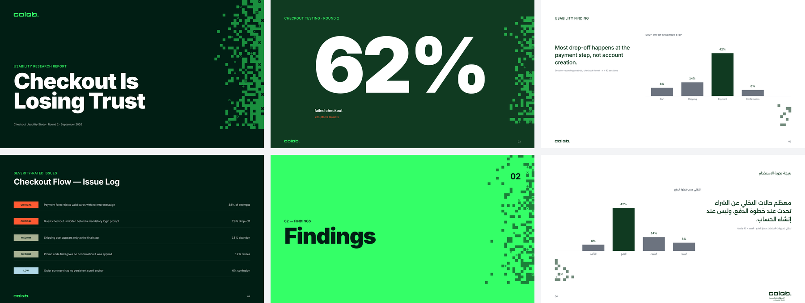

<p align="center">
  
</p>

# colab-design

[](https://github.com/Gamaleldientarek/colab-design/actions/workflows/ci.yml)
[](references/release-history.md)

The Colab design system as an Agent Skill. Your agent builds Colab decks, reports, pages and Arabic versions to the brand's measured rules, without a re-brief each time. Colab is a bilingual EN/AR UX research lab in Saudi Arabia and the wider MENA region.

**[See what you get →](EXAMPLES.md)**

<a href="EXAMPLES.md"></a>

## Install

```bash
npx skills@latest add Gamaleldientarek/colab-design -g -a claude-code -y
```

Needs [Node.js](https://nodejs.org). Restart the agent, then it loads on its own for Colab work, or call `/colab-design`. Other tools: `-a cursor`, `-a codex`, `-a github-copilot`, or `-a '*'` for all. Update with `npx skills@latest update -g`. No terminal? See [INSTALL.md](https://github.com/Gamaleldientarek/azmx/blob/main/INSTALL.md).

<details>
<summary>Pinned install, for a project that must stay on a reviewed commit</summary>

```bash
mkdir -p .claude/skills
git clone --no-checkout https://github.com/Gamaleldientarek/colab-design.git .claude/skills/colab-design
git -C .claude/skills/colab-design checkout --detach 20ffe419f8d7cf3a47c695b3de96996447fd86c5
```

Stop if any command fails, and do not overwrite an existing folder. For Codex, use `.agents/skills`. A pinned install only moves to a commit a maintainer has reviewed. See [SECURITY.md](SECURITY.md).

</details>

## The rule that governs everything

**Electric Green `#34FF67` is an accent on dark, never a surface behind body text.**

| Electric Green on | Contrast |
|---|---|
| White | **1.34 : 1**, fails everything |
| Pine Green `#103A21` | **9.49 : 1**, AAA |
| Deep Jade `#011E14` | **13.07 : 1**, AAA |

## What it covers

- **Colour and tokens:** full palette with computed WCAG ratios, four grounds as Figma variable modes ([colors](references/colors.md), [tokens](references/token-system.md))
- **Type and grid:** Inter and Alexandria, 1920×1080 on 8 columns, fixed vertical anchors ([layouts](references/layout-archetypes.md), [technique](references/editorial-technique.md))
- **Layouts:** 14 archetypes and 36 measured slides ([slide library](references/slide-library.md), [report template](references/report-template.md))
- **Motif:** the 20 px pixel and dither field ([layouts §4](references/layout-archetypes.md))
- **Arabic / RTL:** mirroring, auto-layout, bidi and verification ([rtl-arabic](references/rtl-arabic.md))
- **Icons and assets:** Hugeicons Stroke Rounded, logos and shapes ([icons](references/icons.md), [logo and shapes](references/logo-and-shapes.md))
- **Client law:** standing decisions C-01 to C-17 ([decision law](references/decision-law.md))

<details>
<summary>Bundled assets</summary>

```
assets/
  logo/                           21 logo SVGs, 7 lockups × 3 colours
  shapes/                         40 shape SVGs, 20 primitives × brand/white
  icons/stroke-rounded/           5,437 Hugeicons SVGs, MIT
```

</details>

## Releases

Every release is listed in [release history](references/release-history.md) with its commit, and explained in the [changelog](CHANGELOG.md). A major version means a published value changed, so check it before reusing older work. To contribute, read [CONTRIBUTING.md](CONTRIBUTING.md).

## Licence

Tooling and documentation structure: MIT. The Colab brand assets, palette and identity belong to Colab and are not licensed for reuse. Icons are the Hugeicons free set, MIT, per `assets/icons/LICENSE`; Hugeicons Pro styles are not included. Derived from the client's Figma file (audited 2026-07-26), its Brand Book and 37 client-approved slides.
